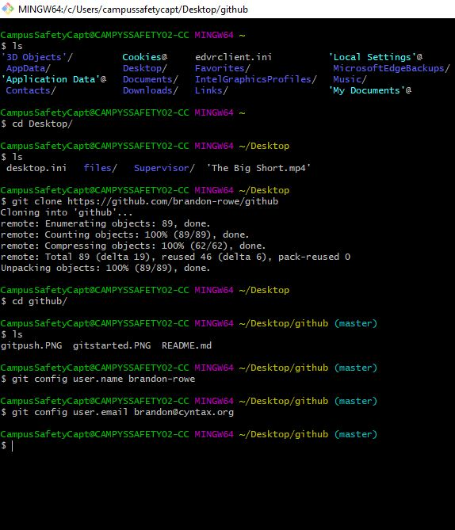
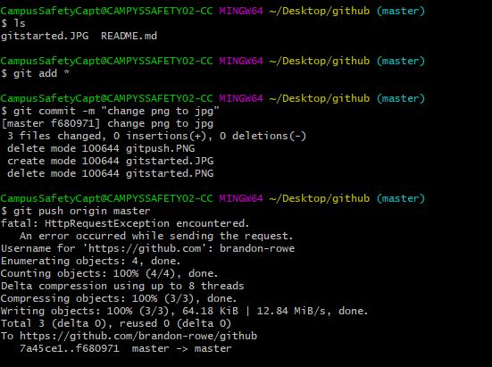

# github
Learning git

What OS are you using? (Windows, Mac, Linux) Download git from link below.

+ [Git for Windows](https://git-scm.com/download/win)
+ [Git for Mac](https://git-scm.com/download/mac)
+ [Git for Linux](https://git-scm.com/download/linux)

<h3>Use</h3>

Download and Install from link above.
 
Open Git Bash.
 

Format: 
 
 

This is a repo for testing git. Use this to test push/pull/merge with different branches.
 
Links in the resources list have indepth tutorials for walking through the basics of git.

<h6>Resources</h6>

Extra links that help with github.
+ [Github Getting Started](https://rogerdudler.github.io/git-guide/)
+ [Branching](https://confluence.atlassian.com/bitbucket/branching-a-repository-223217999.html)
+ [Merging Two Repositories](https://gist.github.com/msrose/2feacb303035d11d2d05)
+ [Managing Projects](https://help.github.com/en/articles/configuring-automation-for-project-boards)
+ [Remote Server Setup](https://kbroman.org/github_tutorial/pages/init.html)
+ [Git-checkout docs](https://git-scm.com/docs/git-checkout)
+ [Finding Open-Source Programs](https://help.github.com/en/articles/finding-open-source-projects-on-github)
+ [Kanban Automation](https://help.github.com/en/articles/configuring-automation-for-project-boards)
+ [Mastering Markup](https://guides.github.com/features/mastering-markdown/)

